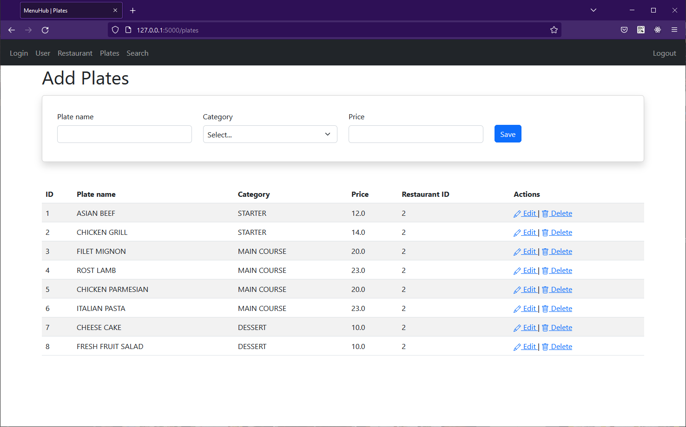

# puc-menu-hub

This project is a CRUD system developed with Python and the Flask framework. It's a small system of register of users, restaurants and plates.

# Screenshot



# Installing

open the terminal and run the following commands:


```
git clone https://github.com/oluizeduardo/puc-menu-hub
```
```
cd puc-menu-hub/
```
```
python3 -m venv venv
```
```
<root_folder> venv/Scripts/activate
```
```
pip install --upgrade pip
```
```
pip install -r requirements.txt
```
```
flask db init
```
```
flask db migrate -m "First migration"
```
```
flask db upgrade
```
```
flask run
```
```
http://127.0.0.1:5000/login
```